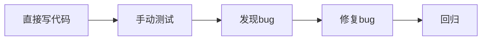
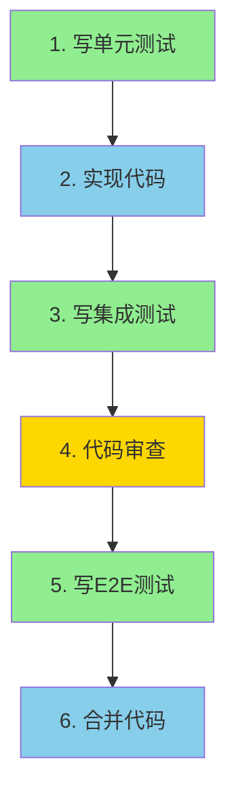

# Bug预防指南

## 🏗️ 开发工作流 - **必须遵守**

### ⚠️ **黄金法则: 测试金字塔工作流**

```
任何代码变更都必须遵循此顺序:
1. 单元测试 (Unit Tests)
2. 集成测试 (Integration Tests)  
3. E2E测试 (End-to-End Tests)

❌ 禁止: 先写代码再补测试
✅ 正确: TDD或至少先写测试,后写代码
```

#### 📐 测试金字塔结构

```
           /\
          /  \      ← E2E测试 (少量)
         /____\
        /      \    ← 集成测试 (适量)
       /________\
      /          \  ← 单元测试 (大量)
     /____________\
```

**原则**:
- 底层(单元): 70% - 快速、隔离、可并行
- 中层(集成): 20% - 验证模块协作
- 顶层(E2E): 10% - 验证关键用户路径

---

## 📋 已知Bug案例

### 案例1: API响应路径错误 (2026-01-29)

**问题描述**: AI助手新增客户后,点击"查看客户详情"无法跳转

**根本原因**:
```typescript
// ❌ 错误代码
const customerId = result?.id || "";  // result是 { data: { id: ... } }

// ✅ 正确代码  
const customerId = result?.data?.id || "";
```

**影响范围**: 用户无法从AI助手页面跳转到新创建的客户详情页

**修复commit**: `fix(ai-assistant): correct customer ID extraction from API response`

---

## 🛡️ 预防措施

### 1. 类型安全的API响应

#### ✅ DO - 使用统一的API响应类型

```typescript
// app/lib/api-types.ts
export type ApiResponse<T> = {
  data: T;
};

// API路由
import { createApiResponse } from "../../lib/api-types";

export async function POST(request: Request) {
  const customer = await createCustomer(data);
  
  // 类型安全的响应
  const response: ApiResponse<Customer> = createApiResponse(customer);
  return NextResponse.json(response, { status: 201 });
}
```

#### ❌ DON'T - 使用动态类型

```typescript
// 不推荐: 使用 any 绕过类型检查
const result = await mutateAsync(data) as any;
const id = result?.id; // ❌ 类型不安全

// 推荐: 定义明确的类型
type CreateCustomerResponse = ApiResponse<Customer>;
const result = await mutateAsync(data) as CreateCustomerResponse;
const id = result.data.id; // ✅ 类型安全
```

---

### 2. 端到端测试覆盖

#### 测试检查清单

每个新功能必须包含:

- [ ] **API响应验证**: 测试API返回的数据结构
- [ ] **类型安全检查**: TypeScript编译无错误
- [ ] **关键用户路径**: 端到端测试主要流程
- [ ] **边界情况**: 空值、错误处理

#### 示例测试用例

```typescript
// tests/ai-assistant.test.ts
describe('AI Assistant - Customer Creation Flow', () => {
  it('should navigate to customer detail after creation', async () => {
    // 1. 生成客户卡片
    const card = await aiAssistant.generateCustomerCard("腾讯 马化腾");
    
    // 2. 确认新增
    const response = await aiAssistant.confirmCustomerCreation(card);
    
    // 3. 验证响应格式
    expect(response).toHaveProperty('data');
    expect(response.data).toHaveProperty('id');
    
    // 4. 验证可以提取ID
    const customerId = response.data.id;
    expect(customerId).toMatch(/^cus_/);
    
    // 5. 验证路由跳转
    const router = createMockRouter();
    await router.push(`/customers/${customerId}`);
    expect(router.push).toHaveBeenCalledWith(`/customers/${customerId}`);
  });
});
```

---

### 3. 代码审查检查点

#### PR Review Checklist

在合并代码前,检查以下项目:

**类型安全**:
- [ ] 没有 `as any` (除非有充分理由)
- [ ] 所有API响应都有类型定义
- [ ] TypeScript编译无错误

**API集成**:
- [ ] API响应结构与使用端匹配
- [ ] 错误处理完整
- [ ] 有加载状态和错误提示

**用户体验**:
- [ ] 关键流程可端到端测试
- [ ] 路由跳转逻辑正确
- [ ] 表单验证清晰

---

### 4. 开发工作流改进

#### 🚫 错误工作流 (禁止!)



**问题**:
- ❌ 测试滞后,bug发现晚
- ❌ 修复成本高
- ❌ 缺乏测试保护
- ❌ 重构困难

#### ✅ 正确工作流 (必须遵守!)



**实施步骤**:

**第1层: 单元测试 (70%)**
```typescript
// tests/unit/customer-card.test.ts
import { describe, it, expect } from 'vitest';

describe('CustomerCard', () => {
  it('should extract customer ID from API response', () => {
    // Arrange
    const mockResponse = { data: { id: 'cus_123', name: 'Test' } };
    
    // Act
    const customerId = mockResponse.data.id;
    
    // Assert
    expect(customerId).toBe('cus_123');
  });
});
```

**第2层: 集成测试 (20%)**
```typescript
// tests/integration/api/customers.test.ts
import { describe, it, expect, beforeAll, afterAll } from 'vitest';
import { POST } from '@/app/api/customers/route';

describe('POST /api/customers', () => {
  it('should create customer and return correct format', async () => {
    // Arrange
    const body = { name: 'Test', company: 'Test Co' };
    
    // Act
    const response = await POST(createMockRequest(body));
    const result = await response.json();
    
    // Assert
    expect(result).toHaveProperty('data');
    expect(result.data).toHaveProperty('id');
    expect(result.data.id).toMatch(/^cus_/);
  });
});
```

**第3层: E2E测试 (10%)**
```typescript
// tests/e2e/ai-assistant.test.ts
import { test, expect } from '@playwright/test';

test('AI assistant customer creation flow', async ({ page }) => {
  // 1. 访问AI助手页面
  await page.goto('/ai-assistant');
  
  // 2. 输入查询
  await page.fill('[placeholder="输入公司 + 姓名…"]', '腾讯 马化腾');
  await page.click('button:has-text("发送")');
  
  // 3. 等待AI生成卡片
  await page.waitForSelector('text=已生成客户资料卡片');
  
  // 4. 确认新增
  await page.click('button:has-text("确认新增")');
  
  // 5. 验证成功模态框
  await page.waitForSelector('text=客户已新增');
  
  // 6. 点击查看详情
  await page.click('button:has-text("查看客户详情")');
  
  // 7. 验证跳转
  await expect(page).toHaveURL(/\/customers\/cus_/);
});
```

---

### 📊 测试覆盖率要求

| 测试类型 | 覆盖率目标 | 必须 | 工具 |
|---------|-----------|------|------|
| 单元测试 | 80%+ | ✅ | Vitest |
| 集成测试 | 60%+ | ✅ | Vitest + Supertest |
| E2E测试 | 关键路径100% | ✅ | Playwright |

### 🔨 实施时间线

#### 开发阶段 (TDD推荐)
1. **红**: 写失败的测试
2. **绿**: 写最小代码使测试通过
3. **重构**: 优化代码

#### PR提交前
- [ ] 所有单元测试通过
- [ ] 所有集成测试通过
- [ ] E2E测试覆盖关键路径
- [ ] 测试覆盖率达标

#### CI/CD阶段
```yaml
# .github/workflows/test.yml
test:
  steps:
    - name: 单元测试
      run: pnpm test:unit --coverage
      
    - name: 集成测试
      run: pnpm test:integration
      
    - name: E2E测试
      run: pnpm test:e2e
      
    - name: 覆盖率检查
      run: |
        if [ $coverage -lt 80 ]; then
          echo "覆盖率不足80%"
          exit 1
        fi
```

---

### 🎯 关键原则 (永久记住)

1. **测试先行**: 永远先写测试,再写代码
2. **金字塔原则**: 70%单元 / 20%集成 / 10%E2E
3. **快速反馈**: 单元测试必须在秒级完成
4. **隔离性**: 单元测试不依赖外部系统
5. **真实性**: E2E测试模拟真实用户操作

---

### 🚫 常见错误 (必须避免)

1. ❌ "手动测试比写测试快"
   - 真相: 手动测试重复成本高,自动化测试一次性投入,长期回报

2. ❌ "测试写起来很慢"
   - 真相: TDD让开发更快,减少调试时间

3. ❌ "E2E测试能覆盖一切"
   - 真相: E2E测试慢、脆弱、昂贵,应作为补充

4. ❌ "集成前先写完所有功能"
   - 真相: 小步快跑,频繁集成

---

### 5. 工具和自动化

#### ESLint规则

```json
{
  "rules": {
    "@typescript-eslint/no-explicit-any": "error",
    "@typescript-eslint/no-unsafe-assignment": "warn",
    "@typescript-eslint/no-unsafe-member-access": "warn"
  }
}
```

#### Git Hooks (可选)

```bash
#!/bin/bash
# .husky/pre-commit

# 检查是否有新的 'as any'
if git diff --cached | grep -q "as any"; then
  echo "❌ 检测到 'as any', 请使用明确的类型定义"
  exit 1
fi

# 运行TypeScript检查
pnpm exec tsc --noEmit
```

---

## 📚 相关资源

- [TypeScript类型安全最佳实践](https://www.typescriptlang.org/docs/handbook/2/types-from-types.html)
- [React Query类型安全](https://tanstack.com/query/latest/docs/react/typescript)
- [API设计指南](https://github.com/microsoft/api-guidelines)

---

## 🔄 持续改进

每次遇到bug后,更新此文档:

1. 添加bug案例分析
2. 更新预防措施
3. 分享给团队成员
4. 在PR Review中引用

---

**最后更新**: 2026-01-29  
**维护者**: 开发团队
