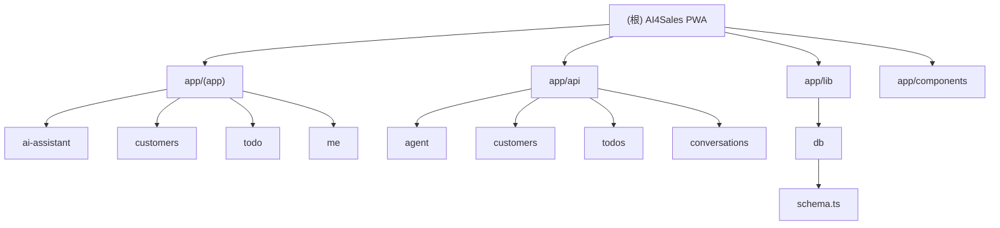
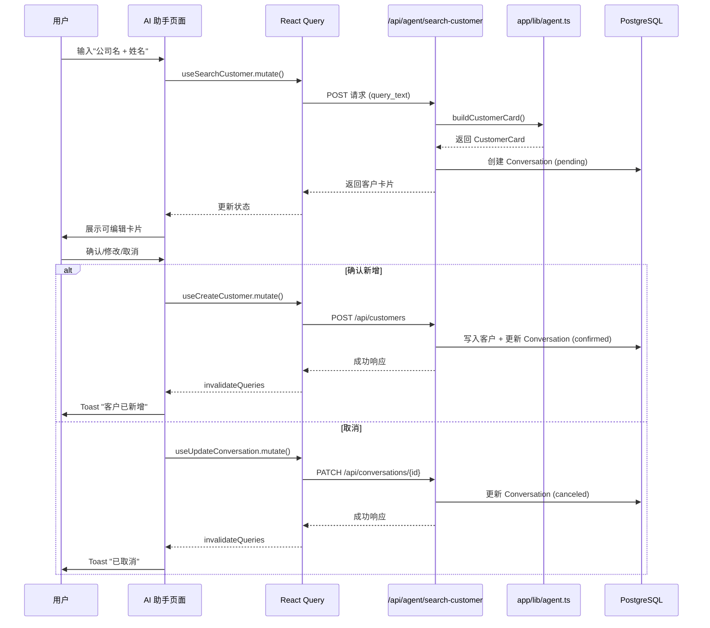

# AI4Sales PWA 应用

> **最后更新**: 2026-01-29 16:38:08
> **项目类型**: Next.js 16 PWA 应用
> **技术栈**: React 19 + TypeScript 5.5 + Tailwind CSS 4 + PostgreSQL 16 + Drizzle ORM 0.38

---

## 📋 变更记录 (Changelog)

### 2026-01-29
- **React Query 集成**: 新增 @tanstack/react-query 用于服务器状态管理
- **Next.js 升级**: 从 14.2.4 升级到 16.1.6
- **React 升级**: 从 18.3.1 升级到 19.0.0
- **Tailwind CSS 升级**: 从 3.4.7 升级到 4.1.18
- **Drizzle ORM 升级**: 从 0.35.1 升级到 0.38.0
- **新增 queries 模块**: app/lib/queries.ts 封装 React Query Hooks
- **UI/UX 优化**: 新增 AIInputDock、FloatingAIButton、BottomNav 组件
- **客户详情页增强**: 支持收起/展开信息区，集成 AI 对话交互

### 2026-01-29 (早期)
- **数据持久化层迁移**: 从 JSON 文件迁移到 PostgreSQL 数据库
- **新增 Drizzle ORM**: 使用 Drizzle ORM 作为数据库访问层
- **新增 Docker Compose**: 添加本地开发环境配置
- **数据库索引优化**: 为常用查询字段添加索引
- **新增数据库迁移管理**: 使用 Drizzle Kit 管理数据库迁移

---

## 📋 项目概览

AI4Sales 是一个面向 B2B 销售人员的移动优先 PWA 应用，通过 AI 助手快速收集客户信息并结构化沉淀为客户档案，提升销售信息收集与行动效率。

### 核心价值主张

- **AI 驱动的客户信息收集**: 输入"单位+姓名" → AI 联网检索 → 生成可编辑客户卡片 → 确认入库
- **轻量级 CRM**: 客户管理、待办事项、对话历史一体化
- **移动优先**: PWA 架构，支持离线访问、添加到桌面

### 目标用户

- 一线销售：高频拜访、快速查客户背景
- 大客户销售/BD：需要丰富的客户画像
- 销售主管：关注团队客户沉淀与行动执行

---

## 🏗️ 架构总览

```mermaid
graph TB
    subgraph "前端层 (Next.js App Router)"
        A[根布局 app/layout.tsx]
        B[应用布局 app/app/layout.tsx]
        C[AI 助手页面]
        D[客户列表页面]
        E[待办列表页面]
        F[我的页面]
        G[全局组件]
    end

    subgraph "状态管理层 (React Query)"
        H[QueryClientProvider]
        I[useCustomers]
        J[useTodos]
        K[useConversations]
        L[useSearchCustomer]
    end

    subgraph "API 层 (Route Handlers)"
        M[/api/agent/search-customer]
        N[/api/customers]
        O[/api/todos]
        P[/api/conversations]
    end

    subgraph "业务逻辑层"
        Q[app/lib/agent.ts - AI 客户卡片生成]
        R[app/lib/db.ts - 数据库操作]
        S[app/lib/queries.ts - React Query Hooks]
        T[app/lib/types.ts - 类型定义]
        U[app/lib/db/schema.ts - 数据库 Schema]
    end

    subgraph "数据层"
        V[(PostgreSQL 数据库)]
        W[Drizzle ORM]
    end

    B --> C
    B --> D
    B --> E
    B --> F
    B --> G

    C --> H
    D --> I
    E --> J
    C --> K

    H --> L
    I --> M
    J --> N
    K --> O

    M --> Q
    N --> R
    O --> R
    P --> R

    Q --> R
    R --> S
    R --> T
    R --> U
    R --> W
    W --> V

    style C fill:#e1f5ff
    style H fill:#f0e1ff
    style M fill:#fff4e1
    style Q fill:#ffe1f5
    style V fill:#e1ffe1
```

---

## 📁 模块索引



### 1. 前端页面模块 (`app/(app)/`)
- **路径**: `app/(app)/`
- **职责**: 用户界面层，包含所有页面组件
- **详细文档**: [app/(app)/CLAUDE.md](app/(app)/CLAUDE.md)

### 2. API 路由模块 (`app/api/`)
- **路径**: `app/api/`
- **职责**: RESTful API 端点，处理客户、待办、对话、AI 检索
- **详细文档**: [app/api/CLAUDE.md](app/api/CLAUDE.md)

### 3. 业务逻辑模块 (`app/lib/`)
- **路径**: `app/lib/`
- **职责**: 核心业务逻辑、数据库操作、类型定义、React Query Hooks
- **详细文档**: [app/lib/CLAUDE.md](app/lib/CLAUDE.md)

### 4. 数据库 Schema 模块 (`app/lib/db/`)
- **路径**: `app/lib/db/`
- **职责**: Drizzle ORM 数据库表定义
- **关键文件**: `schema.ts` - 定义 customers、todos、conversations 表结构

### 5. 共享组件模块 (`app/components/`)
- **路径**: `app/components/`
- **职责**: 可复用的 UI 组件
- **详细文档**: [app/components/CLAUDE.md](app/components/CLAUDE.md)

---

## 🎯 核心功能流程

### AI 客户检索与入库流程



---

## 🔧 技术栈详情

### 前端框架
- **Next.js 16.1.6**: App Router、Server Components、Route Handlers
- **React 19.0.0**: 函数式组件、Hooks、Server Actions
- **TypeScript 5.5.4**: 类型检查（strict: false）

### 状态管理
- **@tanstack/react-query 5.90.20**: 服务器状态管理
  - 自动缓存与重新验证
  - 乐观更新
  - 并行查询
  - 分页与无限滚动支持

### 样式方案
- **Tailwind CSS 4.1.18**: 实用优先的 CSS 框架
- **@tailwindcss/postcss 4.1.18**: PostCSS 插件
- **自定义设计系统**: CSS 变量 + Tailwind 扩展配置
  - 颜色系统: bg-primary/secondary/surface, accent, text-primary/secondary/tertiary
  - 阴影系统: subtle/medium/accent
  - 字体系统: display/body/mono

### 数据管理
- **PostgreSQL 16**: 生产级关系型数据库
- **Drizzle ORM 0.38.0**: 类型安全的 ORM 框架
- **pg 8.13.3**: PostgreSQL 客户端
- **连接池管理**: 使用 pg Pool 管理数据库连接
- **写入队列机制**: 全局队列防止并发写入冲突
- **类型安全**: 完整的 TypeScript 类型定义

### 数据库特性
- **自动建表**: 首次启动自动创建表结构
- **索引优化**: 为常用查询字段添加索引
  - customers: name, company, updated_at, tags (GIN)
  - todos: status, priority, updated_at
  - conversations: status, updated_at, linked_customer_id
- **种子数据**: 首次启动自动写入示例数据
- **事务支持**: 使用 PostgreSQL 事务保证数据一致性

### 开发工具
- **Docker Compose**: 本地开发环境配置
- **Drizzle Kit 0.29.0**: 数据库迁移管理工具
- **Vitest 4.0.18**: 单元测试框架

### AI 搜索引擎
- **Claude Agent SDK**: Anthropic 官方 SDK，用于 AI 代理开发
- **Exa MCP Server**: 高质量 AI 搜索引擎，通过 MCP 协议集成
  - web_search_exa: 高质量网页搜索
  - company_research_exa: 公司信息研究
  - people_search_exa: 人物信息

### PWA 特性
- **Manifest**: `app/manifest.ts` 定义应用元数据
- **图标**: `app/icon.svg`
- **预留**: 离线缓存、推送通知（后续迭代）

---

## 📊 数据模型

### Customer (客户)
```typescript
{
  id: string;              // cus_xxx
  name?: string;           // 姓名
  company?: string;        // 公司
  title?: string;          // 职位
  phones?: string[];       // 手机号列表
  emails?: string[];       // 邮箱列表
  wechat?: string;         // 微信号
  address?: string;        // 地址
  tags?: string[];         // 标签
  profile_markdown?: string; // 非结构化补充信息
  created_at: string;      // ISO 时间戳
  updated_at: string;      // ISO 时间戳
  source: "ai_search" | "manual" | "import";
  last_verified_at?: string;
}
```

### Todo (待办)
```typescript
{
  id: string;              // todo_xxx
  title: string;           // 标题
  description?: string;    // 描述
  priority: "P0" | "P1" | "P2" | "P3";
  status: "open" | "done";
  created_at: string;
  updated_at: string;
}
```

### Conversation (对话)
```typescript
{
  id: string;              // conv_xxx
  title: string;           // 对话标题
  status: "pending" | "confirmed" | "canceled";
  messages: ConversationMessage[];
  attachments?: Attachment[];
  context_customer_ids?: string[];
  ai_outputs?: {
    customer_card?: CustomerCard;
  };
  linked_customer_id?: string;
  created_at: string;
  updated_at: string;
}
```

---

## 🚀 开发指南

### 环境要求
- Node.js 18+
- pnpm (推荐) 或 npm
- Docker (用于本地 PostgreSQL)

### 快速开始
```bash
# 安装依赖
pnpm install

# 启动 PostgreSQL (使用 Docker Compose)
docker-compose up -d

# 配置环境变量
cp .env.local.example .env.local
# 编辑 .env.local，设置 DATABASE_URL 或 PGHOST/PGPORT/PGUSER/PGPASSWORD/PGDATABASE

# 启动开发服务器
pnpm dev

# 构建生产版本
pnpm build

# 启动生产服务器
pnpm start
```

### 数据库管理
```bash
# 生成数据库迁移文件
pnpm db:generate

# 推送 schema 到数据库
pnpm db:migrate
```

### 项目结构
```
ai4sales-pwa-app/
├── app/
│   ├── (app)/              # 应用页面组 (共享布局)
│   │   ├── ai-assistant/   # AI 助手页面
│   │   ├── customers/      # 客户列表与详情
│   │   ├── todo/           # 待办列表
│   │   └── me/             # 个人中心
│   ├── api/                # API 路由
│   │   ├── agent/          # AI 代理相关
│   │   ├── customers/      # 客户 CRUD
│   │   ├── todos/          # 待办 CRUD
│   │   └── conversations/  # 对话管理
│   ├── components/         # 共享组件
│   ├── hooks/              # 自定义 Hooks
│   ├── lib/                # 业务逻辑与工具
│   │   ├── db/             # 数据库 Schema
│   │   │   └── schema.ts   # Drizzle ORM 表定义
│   │   ├── agent.ts        # AI 客户卡片生成
│   │   ├── db.ts           # 数据库操作
│   │   ├── queries.ts      # React Query Hooks
│   │   └── types.ts        # 类型定义
│   ├── app/                # React Query Provider
│   ├── globals.css         # 全局样式
│   ├── layout.tsx          # 根布局
│   ├── manifest.ts         # PWA Manifest
│   └── page.tsx            # 首页 (重定向)
├── docker-compose.yml      # Docker Compose 配置
├── drizzle.config.ts       # Drizzle Kit 配置
├── PRD.md                  # 产品需求文档
├── next.config.js          # Next.js 配置
├── tailwind.config.js      # Tailwind 配置
└── tsconfig.json           # TypeScript 配置
```

---

## 📝 编码规范

### 命名约定
- **组件**: PascalCase (e.g., `CustomerCard.tsx`)
- **函数/变量**: camelCase (e.g., `handleSearch`)
- **类型/接口**: PascalCase (e.g., `Customer`, `TodoPriority`)
- **常量**: UPPER_SNAKE_CASE (e.g., `DATA_FILE`)
- **文件**: kebab-case 或 PascalCase (组件)

### 代码风格
- **TypeScript**: 优先使用类型推断，复杂类型显式声明
- **React**: 函数式组件 + Hooks，避免类组件
- **异步处理**: async/await，统一错误处理
- **注释**: 关键业务逻辑添加中文注释

### React Query 使用规范

#### Query Keys
```typescript
export const queryKeys = {
  todos: (params = {}) => ["todos", params] as const,
  todo: (id) => ["todo", id] as const,
  customers: (params = {}) => ["customers", params] as const,
  customer: (id) => ["customer", id] as const,
  conversations: (params = {}) => ["conversations", params] as const,
  conversation: (id) => ["conversation", id] as const,
} as const;
```

#### 数据获取
```typescript
const { data, isLoading, error } = useCustomers(
  { page: 1, pageSize: 10 },
  {
    staleTime: 1000 * 60 * 5, // 5 分钟
    refetchOnWindowFocus: false,
  }
);
```

#### 数据变更
```typescript
const createCustomer = useCreateCustomer();
createCustomer.mutate(data, {
  onSuccess: () => {
    // 成功后自动刷新相关查询
  }
});
```

### 组件设计原则
- **单一职责**: 每个组件只负责一个功能
- **可复用性**: 提取通用组件到 `app/components/`
- **类型安全**: 所有 props 和状态都有明确类型
- **无障碍性**: 使用语义化 HTML，添加 ARIA 属性

---

## 🔐 安全与性能

### 安全措施
- **输入验证**: API 层验证所有用户输入
- **错误处理**: 统一错误响应格式，不暴露敏感信息
- **连接池管理**: 使用 pg Pool 管理数据库连接，防止连接泄漏
- **SQL 注入防护**: 使用 Drizzle ORM 参数化查询

### 性能优化
- **服务端渲染**: 利用 Next.js SSR/SSG
- **代码分割**: 自动路由级代码分割
- **React Query 缓存**: 5 分钟 staleTime，减少不必要的网络请求
- **数据库索引**: 为常用查询字段添加索引
- **连接池复用**: 全局单例 Pool，避免重复创建连接
- **写入队列**: 防止并发写入冲突

---

## 📈 后续迭代计划

### M1 (已完成)
- ✅ PWA 框架 + 3 Tab 导航
- ✅ 客户/待办基础 CRUD
- ✅ AI 助手页面与对话历史
- ✅ PostgreSQL 数据库迁移
- ✅ Drizzle ORM 集成
- ✅ React Query 状态管理
- ✅ UI/UX 优化

### M2 (进行中)
- ✅ Agentic Search 返回客户卡片
- ✅ 客户入库闭环
- ✅ 客户详情页 AI 交互
- ⏳ 上传上下文 (相册/拍照/文件)
- ⏳ @客户选择器

### M3 (规划中)
- 排序/过滤完善
- 客户去重/合并
- TODO 与客户关联

### M4 (未来)
- OCR 名片识别
- 企业工商/新闻动态增强
- 团队版协作与权限
- 推送提醒与离线模式

---

## 🐛 已知问题与限制

1. **AI 检索模拟**: 当前使用 `app/lib/agent.ts` 模拟 AI 检索，未接入真实 LLM API
2. **并发控制**: 写入队列机制简单，高并发场景需优化
3. **类型检查**: `tsconfig.json` 中 `strict: false`，建议逐步启用严格模式
4. **测试覆盖**: 缺少单元测试和集成测试
5. **语音输入**: 仅预留 UI，未实现实际功能
6. **文件上传**: 仅预留 UI，未实现上传逻辑

---

## 📚 相关文档

- [产品需求文档 (PRD)](./PRD.md)
- [UI/UX 设计稿](./ui-ux.pen)
- [Next.js 官方文档](https://nextjs.org/docs)
- [React Query 文档](https://tanstack.com/query/latest)
- [Tailwind CSS 文档](https://tailwindcss.com/docs)
- [Drizzle ORM 文档](https://orm.drizzle.team/)
- [PostgreSQL 文档](https://www.postgresql.org/docs/)

---

## 🤝 贡献指南

1. 遵循现有代码风格和架构模式
2. 所有新功能需更新相应的 CLAUDE.md 文档
3. 提交前运行 `pnpm lint` 检查代码质量
4. 重大变更需更新 PRD.md 和架构图
5. 数据库 schema 变更需生成迁移文件
6. 提交代码前需要进行端到端测试

---

**生成时间**: 2026-01-29 16:38:08
**文档版本**: v3.0.0
