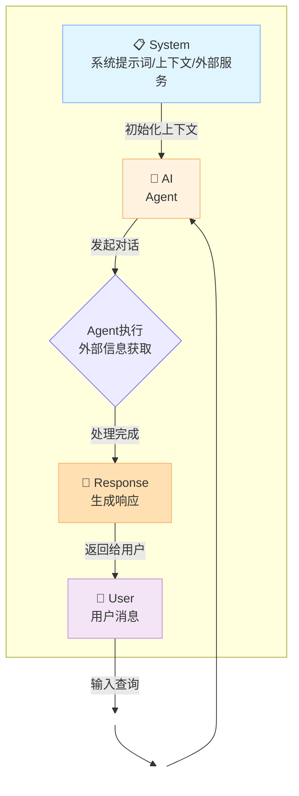
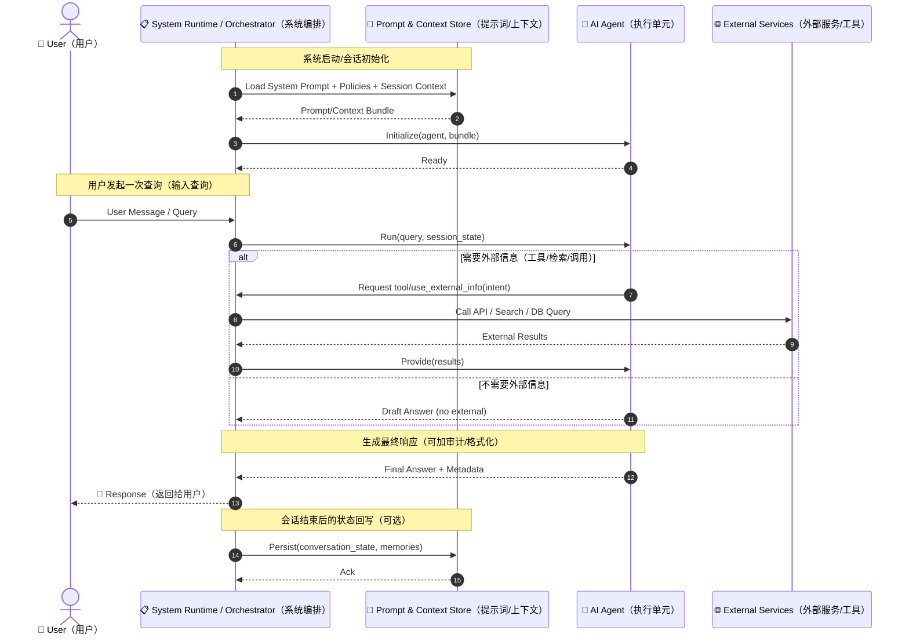
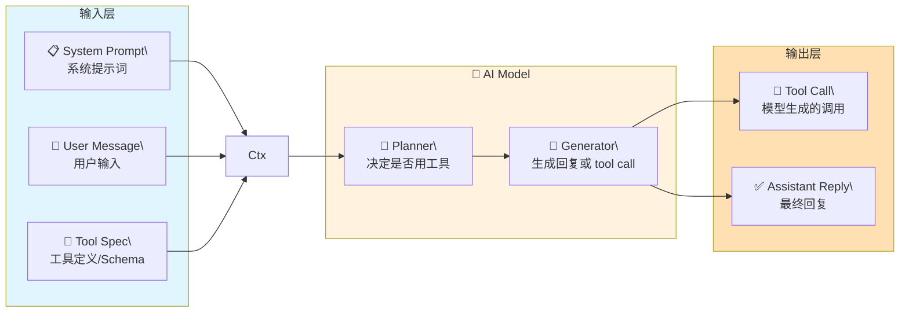
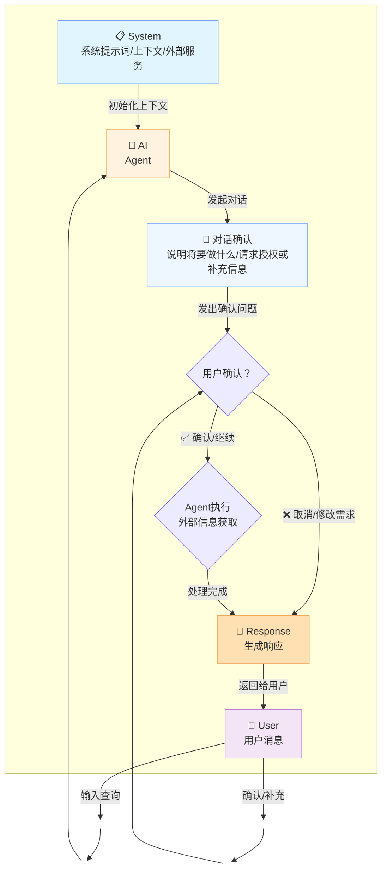
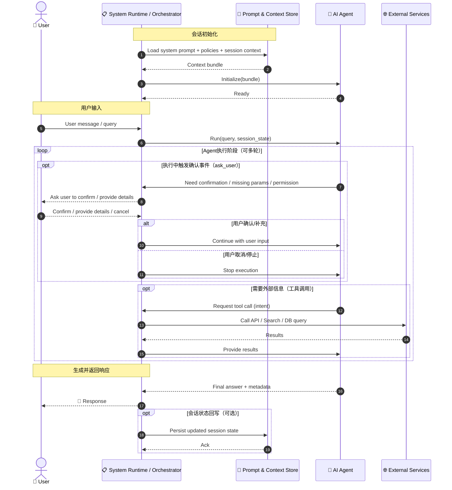
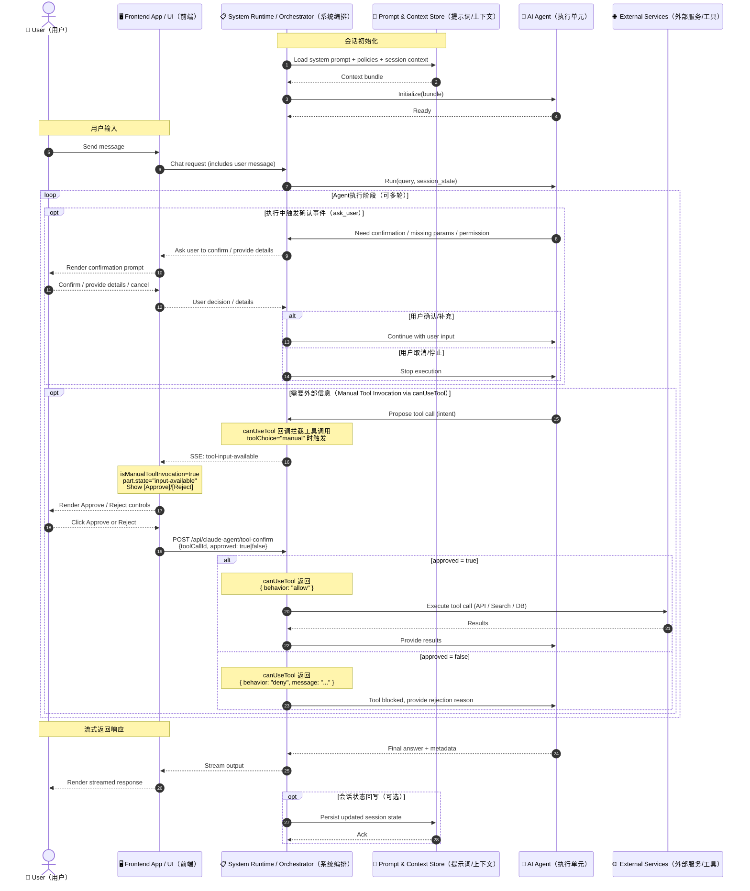

# AI Model 会话流程图

## 基础的业务对话流程

```mermaid
flowchart TB
  %% 主干：强制垂直排列
  subgraph MAIN[" "]
    direction TB
    A["📋 System<br/>系统提示词/上下文/外部服务"]
    B["🤖 AI<br/>Agent"]
    D{"Agent执行<br/>外部信息获取"}
    G["💬 Response<br/>生成响应"]
    C["👤 User<br/>用户消息"]

    A -->|初始化上下文| B
    B -->|发起对话| D
    D -->|处理完成| G
    G -->|返回给用户| C
  end

  %% 右侧回路：用不可见节点做“折线/右侧上行”，避免把User拉到上面
  C -->|输入查询| R1(( ))
  R1 --> R2(( ))
  R2 --> B

  %% 样式
  style A fill:#e1f5ff,stroke:#7aa7ff,stroke-width:1px
  style B fill:#fff3e0,stroke:#f2b36a,stroke-width:1px
  style D fill:#ecebff,stroke:#7a6ff0,stroke-width:1px
  style G fill:#ffe0b2,stroke:#f2b36a,stroke-width:1px
  style C fill:#f3e5f5,stroke:#c08bd6,stroke-width:1px

  %% 让拐点“隐形”，只留下右侧折线路径
  style R1 fill:transparent,stroke:transparent,color:transparent
  style R2 fill:transparent,stroke:transparent,color:transparent

```

## AI服务系统时序图

```mermaid
sequenceDiagram
  autonumber
  actor U as 👤 User（用户）
  participant SYS as 📋 System Runtime / Orchestrator（系统编排）
  participant CTX as 🧠 Prompt & Context Store（提示词/上下文）
  participant AG as 🤖 AI Agent（执行单元）
  participant EXT as 🌐 External Services（外部服务/工具）

  Note over SYS,CTX: 系统启动/会话初始化
  SYS->>CTX: Load System Prompt + Policies + Session Context
  CTX-->>SYS: Prompt/Context Bundle
  SYS->>AG: Initialize(agent, bundle)
  AG-->>SYS: Ready

  Note over U,SYS: 用户发起一次查询（输入查询）
  U->>SYS: User Message / Query
  SYS->>AG: Run(query, session_state)

  alt 需要外部信息（工具/检索/调用）
    AG->>SYS: Request tool/use_external_info(intent)
    SYS->>EXT: Call API / Search / DB Query
    EXT-->>SYS: External Results
    SYS->>AG: Provide(results)
  else 不需要外部信息
    AG-->>SYS: Draft Answer (no external)
  end

  Note over SYS,AG: 生成最终响应（可加审计/格式化）
  AG-->>SYS: Final Answer + Metadata
  SYS-->>U: 💬 Response（返回给用户）

  Note over SYS,CTX: 会话结束后的状态回写（可选）
  SYS->>CTX: Persist(conversation_state, memories)
  CTX-->>SYS: Ack

```

## transfrom模型模板架构

```mermaid

graph LR
    subgraph Inputs[输入层]
      S["📋 System Prompt\\n系统提示词"]
      U["👤 User Message\\n用户输入"]
      TDef["🔧 Tool Spec\\n工具定义/Schema"]
    end

    subgraph Model[🤖 AI Model]
      Planner["📑 Planner\\n决定是否用工具"]
      Generator["💬 Generator\\n生成回复或 tool call"]
    end

    subgraph Outputs[输出层]
      Call["🔧 Tool Call\\n模型生成的调用"]
      Resp["✅ Assistant Reply\\n最终回复"]
    end

    S --> Ctx
    U --> Ctx
    TDef --> Ctx
    Ctx --> Planner
    Planner --> Generator
    Generator --> Call
    Generator --> Resp

    style Inputs fill:#e1f5ff
    style Model fill:#fff3e0
    style Outputs fill:#ffe0b2

```

## 有确认事件的业务对话流程

```mermaid
flowchart TB
  %% 主干：强制垂直排列
  subgraph MAIN[" "]
    direction TB
    A["📋 System<br/>系统提示词/上下文/外部服务"]
    B["🤖 AI<br/>Agent"]

    F["📝 对话确认<br/>说明将要做什么/请求授权或补充信息"]
    H{"用户确认？"}

    D{"Agent执行<br/>外部信息获取"}
    G["💬 Response<br/>生成响应"]
    C["👤 User<br/>用户消息"]

    A -->|初始化上下文| B
    B -->|发起对话| F
    F -->|发出确认问题| H

    H -->|✅ 确认/继续| D
    H -->|❌ 取消/修改需求| G

    D -->|处理完成| G
    G -->|返回给用户| C
  end

  %% 右侧回路1：用户输入查询 -> Agent（保持你原来的“输入查询”右侧上行）
  C -->|输入查询| R1(( ))
  R1 --> R2(( ))
  R2 --> B

  %% 右侧回路2：用户对“确认问题”的回复 -> 确认判断（新增）
  C -->|确认/补充| R3(( ))
  R3 --> R4(( ))
  R4 --> H

  %% 样式
  style A fill:#e1f5ff,stroke:#7aa7ff,stroke-width:1px
  style B fill:#fff3e0,stroke:#f2b36a,stroke-width:1px

  style F fill:#eef7ff,stroke:#7aa7ff,stroke-width:1px
  style H fill:#ecebff,stroke:#7a6ff0,stroke-width:1px

  style D fill:#ecebff,stroke:#7a6ff0,stroke-width:1px
  style G fill:#ffe0b2,stroke:#f2b36a,stroke-width:1px
  style C fill:#f3e5f5,stroke:#c08bd6,stroke-width:1px

  %% 让拐点“隐形”，只留下右侧折线路径
  style R1 fill:transparent,stroke:transparent,color:transparent
  style R2 fill:transparent,stroke:transparent,color:transparent
  style R3 fill:transparent,stroke:transparent,color:transparent
  style R4 fill:transparent,stroke:transparent,color:transparent

```

## 有确认事件的AI服务系统时序图

```mermaid
sequenceDiagram
  autonumber
  actor U as 👤 User
  participant SYS as 📋 System Runtime / Orchestrator
  participant CTX as 🧠 Prompt & Context Store
  participant AG as 🤖 AI Agent
  participant EXT as 🌐 External Services

  Note over SYS,CTX: 会话初始化
  SYS->>CTX: Load system prompt + policies + session context
  CTX-->>SYS: Context bundle
  SYS->>AG: Initialize(bundle)
  AG-->>SYS: Ready

  Note over U,SYS: 用户输入
  U->>SYS: User message / query
  SYS->>AG: Run(query, session_state)

  loop Agent执行阶段（可多轮）
    opt 执行中触发确认事件（ask_user）
      AG->>SYS: Need confirmation / missing params / permission
      SYS-->>U: Ask user to confirm / provide details
      U-->>SYS: Confirm / provide details / cancel
      alt 用户确认/补充
        SYS->>AG: Continue with user input
      else 用户取消/停止
        SYS->>AG: Stop execution
      end
    end

    opt 需要外部信息（工具调用）
      AG->>SYS: Request tool call (intent)
      SYS->>EXT: Call API / Search / DB query
      EXT-->>SYS: Results
      SYS->>AG: Provide results
    end
  end

  Note over SYS,U: 生成并返回响应
  AG-->>SYS: Final answer + metadata
  SYS-->>U: 💬 Response

  opt 会话状态回写（可选）
    SYS->>CTX: Persist updated session state
    CTX-->>SYS: Ack
  end

```

## 与有确认事件的前端组件与AI服务系统交互的时序图

```mermaid
sequenceDiagram
  autonumber
  actor U as 👤 User（用户）
  participant FE as 🖥️ Frontend App / UI（前端）
  participant SYS as 📋 System Runtime / Orchestrator（系统编排）
  participant CTX as 🧠 Prompt & Context Store（提示词/上下文）
  participant AG as 🤖 AI Agent（执行单元）
  participant EXT as 🌐 External Services（外部服务/工具）

  Note over SYS,CTX: 会话初始化
  SYS->>CTX: Load system prompt + policies + session context
  CTX-->>SYS: Context bundle
  SYS->>AG: Initialize(bundle)
  AG-->>SYS: Ready

  Note over U,FE: 用户输入
  U->>FE: Send message
  FE->>SYS: Chat request (includes user message)
  SYS->>AG: Run(query, session_state)

  loop Agent执行阶段（可多轮）
    opt 执行中触发确认事件（ask_user）
      AG->>SYS: Need confirmation / missing params / permission
      SYS-->>FE: Ask user to confirm / provide details
      FE-->>U: Render confirmation prompt
      U-->>FE: Confirm / provide details / cancel
      FE-->>SYS: User decision / details
      alt 用户确认/补充
        SYS->>AG: Continue with user input
      else 用户取消/停止
        SYS->>AG: Stop execution
      end
    end

    opt 需要外部信息（Manual Tool Invocation via canUseTool）
      AG->>SYS: Propose tool call (intent)
      Note over SYS: canUseTool 回调拦截工具调用<br/>toolChoice="manual" 时触发
      SYS-->>FE: SSE: tool-input-available
      Note over FE: isManualToolInvocation=true<br/>part.state="input-available"<br/>Show [Approve]/[Reject]
      FE-->>U: Render Approve / Reject controls
      U-->>FE: Click Approve or Reject
      FE->>SYS: POST /api/claude-agent/tool-confirm<br/>{toolCallId, approved: true|false}

      alt approved = true
        Note over SYS: canUseTool 返回<br/>{ behavior: "allow" }
        SYS->>EXT: Execute tool call (API / Search / DB)
        EXT-->>SYS: Results
        SYS->>AG: Provide results
      else approved = false
        Note over SYS: canUseTool 返回<br/>{ behavior: "deny", message: "..." }
        SYS->>AG: Tool blocked, provide rejection reason
      end
    end
  end

  Note over FE,U: 流式返回响应
  AG-->>SYS: Final answer + metadata
  SYS-->>FE: Stream output
  FE-->>U: Render streamed response

  opt 会话状态回写（可选）
    SYS->>CTX: Persist updated session state
    CTX-->>SYS: Ack
  end

```