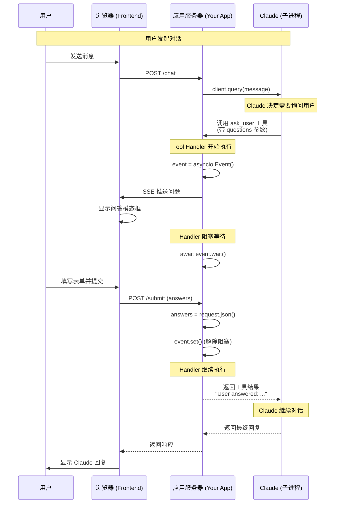
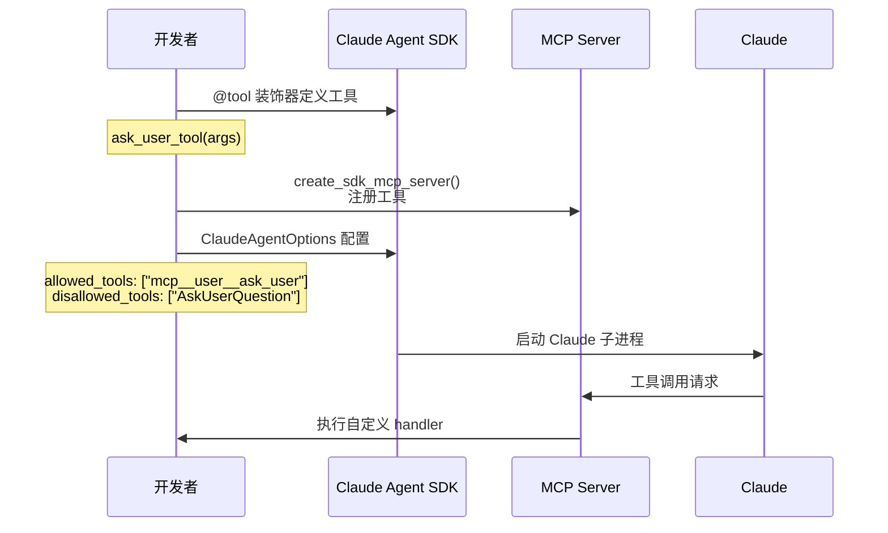
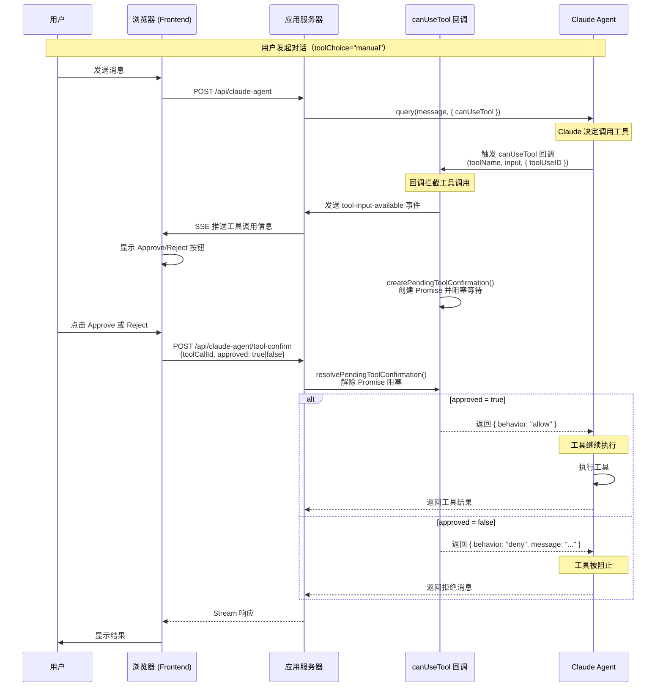
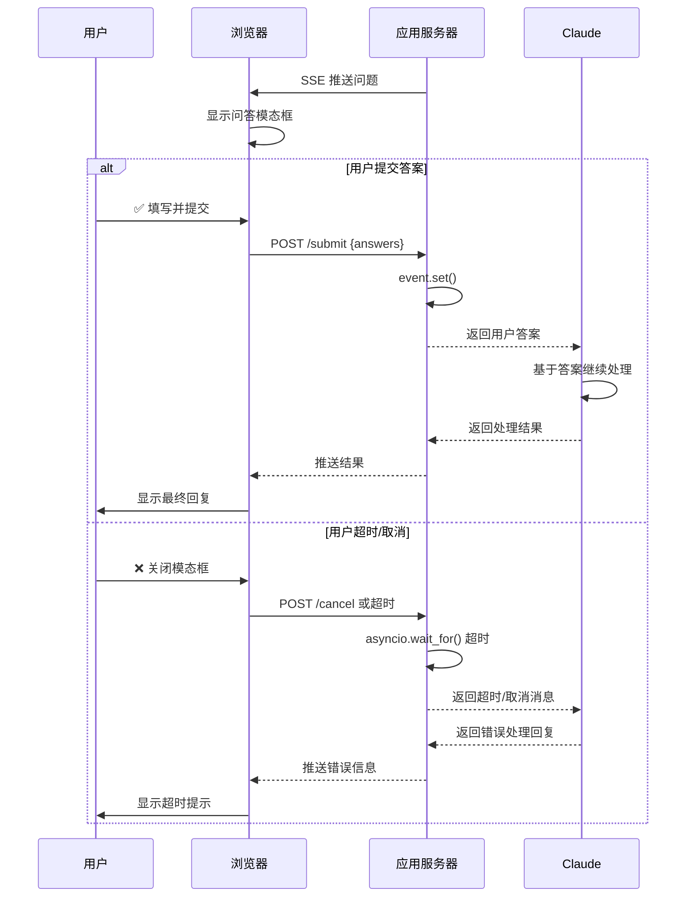

> 来源: When Claude Can't Ask: Building Interactive Tools for the Agent SDK
> 

## 核心交互模式

当 Claude 调用自定义 MCP 工具时，整个流程如下：



## 工具定义与注册



## 使用 canUseTool 实现工具确认

Claude Agent SDK 提供 `canUseTool` 回调作为官方权限处理器，用于在工具执行前控制是否允许。这是实现工具确认的推荐方式。

> 参考: https://platform.claude.com/docs/en/agent-sdk/user-input



### canUseTool 配置（TypeScript）

```typescript
import type { CanUseTool, PermissionResult } from "@anthropic-ai/claude-agent-sdk";

// canUseTool 回调函数
const canUseTool: CanUseTool = async (
  toolName: string,
  toolInput: Record<string, unknown>,
  options: { signal: AbortSignal; toolUseID: string }
): Promise<PermissionResult> => {
  const toolCallId = options.toolUseID;
  
  // 通知 UI 显示确认按钮
  await sendToolApprovalRequest(toolCallId, toolName, toolInput);
  
  // 阻塞等待用户确认
  const result = await createPendingToolConfirmation(toolCallId, toolName, toolInput);
  
  if (result.approved) {
    return {
      behavior: 'allow',
      toolUseID: toolCallId,
    };
  } else {
    return {
      behavior: 'deny',
      message: result.reason || '用户拒绝',
      toolUseID: toolCallId,
    };
  }
};

// SDK Options 配置
const sdkOptions = {
  canUseTool,  // 注册权限处理器
  permissionMode: "bypassPermissions",  // 跳过内置权限提示
};
```

## 用户批准/拒绝决策分支



## 关键代码模式

### Tool Handler 阻塞模式（Python）

```python
# 在工具 handler 中:
event = asyncio.Event()
await send_questions_to_browser(questions)  # SSE 推送
await event.wait()  # 阻塞等待用户响应
return answers

# 在 /submit endpoint 中:
answers = request.json()
event.set()  # 解除阻塞

```

### Tool Confirmation Store（TypeScript/Node.js）

```typescript
// tool-confirmation-store.ts
// 创建待确认项并返回 Promise（阻塞）
export function createPendingToolConfirmation(
  toolCallId: string,
  toolName: string,
  input: Record<string, unknown>
): Promise<ToolConfirmationResult> {
  return new Promise((resolve, reject) => {
    pendingConfirmations.set(toolCallId, { resolve, reject, ... });
    
    // 超时保护
    setTimeout(() => {
      if (pendingConfirmations.has(toolCallId)) {
        pendingConfirmations.delete(toolCallId);
        reject(new Error('Confirmation timeout'));
      }
    }, 300000); // 5分钟
  });
}

// 解除阻塞（在 /api/claude-agent/tool-confirm 中调用）
export function resolvePendingToolConfirmation(
  toolCallId: string,
  result: { approved: boolean; reason?: string }
): boolean {
  const pending = pendingConfirmations.get(toolCallId);
  if (pending) {
    pending.resolve(result);
    pendingConfirmations.delete(toolCallId);
    return true;
  }
  return false;
}
```

### 超时处理

```python
# Python: 添加超时保护，防止 handler 永久阻塞
await asyncio.wait_for(event.wait(), timeout=300)  # 5分钟超时

```

```typescript
// TypeScript: 在 createPendingToolConfirmation 中已内置超时
// timeout 参数可配置，默认 5 分钟
```

## 应用场景

此模式可扩展到多种交互场景：

| 场景 | 描述 |
| --- | --- |
| 审批工作流 | 显示 diff，等待批准/拒绝 |
| 文件选择器 | 让用户基于提示浏览和选择文件 |
| 配置向导 | 带验证的多步骤表单 |
| 人工介入 | 在执行破坏性操作前暂停审核 |
| 富输入 | 图片标注、拖放等前端支持的任何交互 |