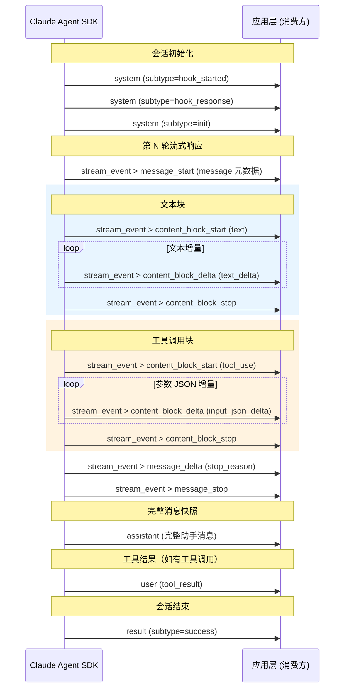

# Claude SDK Message 事件类型层级

> 数据来源: `docs/data/claude-sdk-message.json`（一次完整 Claude Agent 会话的 SSE 消息流）

## 事件类型树形总览

```
顶层数组 (300 个事件对象)
├── system          (3)   ← 系统事件
│   ├── subtype: hook_started     (1)
│   ├── subtype: hook_response    (1)
│   └── subtype: init             (1)
│
├── stream_event    (285) ← SSE 流式事件（占 95%）
│   ├── message_start       (5)   → 内嵌 message (type=message)
│   ├── content_block_start (7)
│   │   ├── content_block.type = text       (3)  ← 文本块开始
│   │   └── content_block.type = tool_use   (4)  ← 工具调用块开始
│   ├── content_block_delta (256)
│   │   ├── delta.type = text_delta         (252) ← 文本增量流
│   │   └── delta.type = input_json_delta   (4)   ← 工具参数 JSON 增量流
│   ├── content_block_stop  (7)
│   ├── message_delta       (5)
│   └── message_stop        (5)
│
├── assistant       (7)   ← 助手完整回复消息（含 text / tool_use content）
├── user            (4)   ← 用户消息（含 tool_result content）
└── result          (1)   ← 最终结果
    └── subtype: success          (1)
```

## 第 1 层：顶层事件类型

顶层数组中每个对象都有 `type` 字段，共 **5 种**：

| type | 数量 | 说明 |
|------|------|------|
| `stream_event` | 285 | SSE 流式事件，占绝大多数，携带实时流数据 |
| `assistant` | 7 | 助手完整回复消息（一轮工具调用结束后的完整消息快照） |
| `user` | 4 | 用户消息（包含 `tool_result` 类型的 content） |
| `system` | 3 | 系统事件，通过 `subtype` 细分 |
| `result` | 1 | 会话最终结果 |

### system 子类型（subtype）

| subtype | 说明 |
|---------|------|
| `hook_started` | Hook 开始执行（SessionStart 等生命周期钩子） |
| `hook_response` | Hook 执行结果返回 |
| `init` | 会话初始化完成 |

### result 子类型（subtype）

| subtype | 说明 |
|---------|------|
| `success` | 会话成功结束 |

---

## 第 2 层：stream_event 内嵌事件类型

`stream_event` 对象内部包含一个嵌套对象，其 `type` 字段标识具体的流事件，共 **6 种**：

| stream_event 内嵌 type | 数量 | 说明 |
|---|---|---|
| `content_block_delta` | 256 | 内容块增量更新（文本流/工具参数流） |
| `content_block_start` | 7 | 内容块开始（标识块类型：text 或 tool_use） |
| `content_block_stop` | 7 | 内容块结束 |
| `message_start` | 5 | 消息开始（携带完整 message 元数据：role/model/usage） |
| `message_delta` | 5 | 消息级增量（stop_reason 等） |
| `message_stop` | 5 | 消息结束 |

---

## 第 3 层：content_block / delta 内嵌类型

### content_block_start 内的 content_block.type

| content_block.type | 数量 | 说明 |
|---|---|---|
| `text` | 3 | 新文本块开始 |
| `tool_use` | 4 | 新工具调用块开始（含 tool name/id） |

### content_block_delta 内的 delta.type

| delta.type | 数量 | 说明 |
|---|---|---|
| `text_delta` | 252 | 文本增量（最高频事件，占总量 84%） |
| `input_json_delta` | 4 | 工具调用参数 JSON 增量 |

### message_start 内的 message.type

| message.type | 数量 | 说明 |
|---|---|---|
| `message` | 5 | 包含 role/model/usage 等元数据 |

---

## 完整类型链路汇总

从顶层到最深层的所有唯一路径：

| 完整类型链 | 数量 | 说明 |
|---|---|---|
| `stream_event > content_block_delta > text_delta` | 252 | **最高频** — 文本流式输出 |
| `stream_event > content_block_stop` | 7 | 块结束标记 |
| `stream_event > message_start > message` | 5 | 消息开始 + 元数据 |
| `stream_event > message_delta` | 5 | 消息级更新 |
| `stream_event > message_stop` | 5 | 消息结束标记 |
| `stream_event > content_block_start > tool_use` | 4 | 工具调用块开始 |
| `stream_event > content_block_delta > input_json_delta` | 4 | 工具参数流 |
| `stream_event > content_block_start > text` | 3 | 文本块开始 |

---

## 一轮 Agent 会话的事件流时序



## 前端消费建议

| 事件 | 前端处理 |
|------|----------|
| `system (init)` | 标记会话就绪，可开始接收流 |
| `stream_event > message_start` | 创建新消息容器 |
| `stream_event > content_block_start (text)` | 准备文本渲染区 |
| `stream_event > content_block_delta (text_delta)` | **实时追加文本** |
| `stream_event > content_block_start (tool_use)` | 显示工具调用卡片 |
| `stream_event > content_block_delta (input_json_delta)` | 拼接工具参数 JSON |
| `stream_event > content_block_stop` | 标记当前块完成 |
| `stream_event > message_delta` | 读取 stop_reason（end_turn / tool_use） |
| `stream_event > message_stop` | 标记消息完成 |
| `assistant` | 可用于校验/替换流式拼接结果 |
| `user (tool_result)` | 显示工具执行结果 |
| `result (success)` | 会话结束，解锁输入框 |
