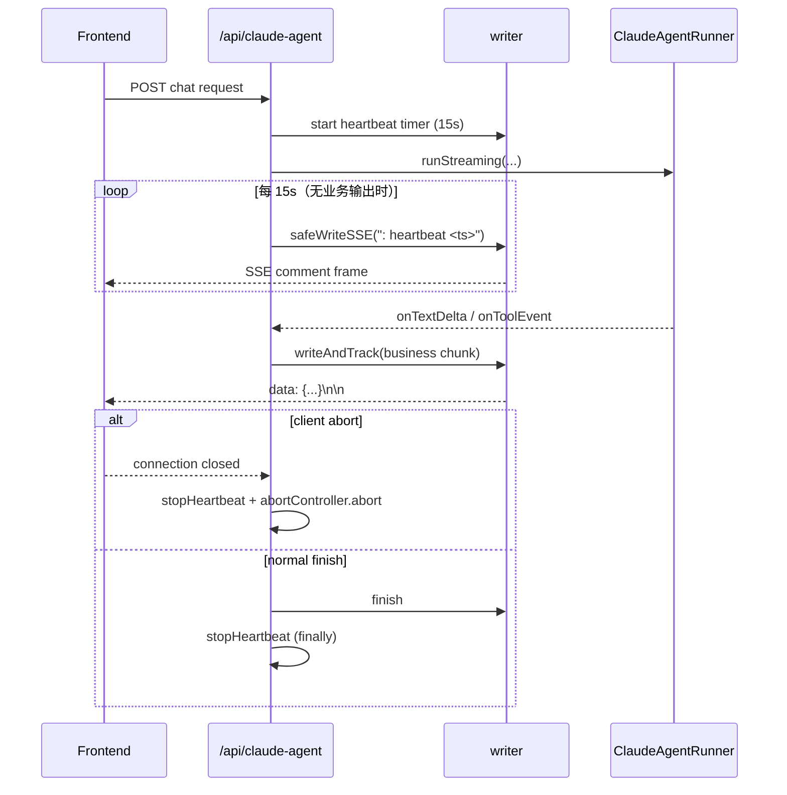

# Claude Agent SSE 心跳与 writer 改造方案

> 路径：`app/api/claude-agent/route.ts`  
> 最后更新：2026-02-08  
> 适用范围：Claude Agent 聊天流式响应（`POST /api/claude-agent`）

---

## 1. 背景与问题

Claude Agent 在执行工具调用、人工确认（manual tool confirm）或长推理时，可能出现较长时间无业务数据输出。  
在真实网络链路中（浏览器、Nginx、边缘网关、CDN），`text/event-stream` 空闲连接常被提前关闭，导致：

- 前端长时间等待后中断，用户感知为“卡住/失败”
- 服务端后续 `writer.write(...)` 在连接已断开时抛错
- 对话最终状态无法稳定落库或收尾

因此需要在 SSE 链路增加心跳帧，并将 `writer` 写入路径统一为“可中断、可清理、可审计”的安全写入模型。

---

## 2. 目标与非目标

### 2.1 目标

- 在无业务事件期间持续发送心跳，保持 SSE 连接活性
- 统一 `writer` 写入入口，避免 close/abort 后继续写
- 确保异常、客户端断开、正常结束都能清理定时器
- 不改变前端既有业务事件协议（text/tool/finish/error）

### 2.2 非目标

- 不改 `app/lib/chat-schema.ts` 协议结构
- 不改 `agent-runner.ts` 的核心消息处理逻辑
- 不引入额外第三方依赖

---

## 3. 总体方案

在 `createUIMessageStream({ execute })` 的 `writer` 层做统一封装：

1. 新增 `safeWritePart`：负责状态检查、异常捕获、abort 判定
2. 新增 `safeWriteSSE`：统一处理“业务 chunk”与“原始 SSE 心跳帧”
3. 新增 `writeAndTrack`：业务写入 + 持久化追踪（跳过 finish/error）
4. 新增 heartbeat timer：定时调用 `safeWriteSSE(buildHeartbeatFrame())`
5. 在 `catch/finally/abort` 全路径执行 `stopHeartbeat()`

在响应编码层（`createClaudeAgentSSEStreamResponse`）新增“心跳专用分支”：

- 使用 `data-sse-heartbeat` transient chunk 标记心跳
- transform 时心跳帧原样输出（注释帧或 event 帧）
- 业务 chunk 仍按 `data: ${JSON.stringify(part)}\n\n` 输出

---

## 4. writer 详细修改说明（重点）

### 4.1 修改点总览

| 修改点 | 修改前 | 修改后 | 原因 | 风险与规避 |
|---|---|---|---|---|
| 写入入口 | 多处直接 `writer.write(...)` | 统一走 `safeWritePart/safeWriteSSE/writeAndTrack` | 收敛写入副作用与异常处理 | 风险：遗漏直接写入；规避：约定 execute 内禁止直写 |
| 连接状态 | 无统一状态位 | 增加 `isClosed`、`isAborted` | close/abort 后快速短路 | 风险：状态竞争；规避：单线程事件循环 + 幂等 stop |
| 心跳写入 | 无 | `setInterval` 定时写心跳帧 | 防空闲断连 | 风险：定时器泄漏；规避：`finally` 必清理 |
| 错误分类 | 写入失败统一报错 | `AbortError` 与普通错误分流 | 降低误报警，便于定位 | 风险：误判 abort；规避：同时检查多个 signal |
| 写入清理 | 分散且不完整 | `stopHeartbeat()` 统一管理 | 保证生命周期闭环 | 风险：重复 clear；规避：空值判断 |
| 数据追踪 | 追踪逻辑与写入耦合松散 | `writeAndTrack` 先写后追踪 | 仅持久化成功发送的业务事件 | 风险：心跳污染持久化；规避：heartbeat 为 transient 且不走 tracking |

### 4.2 `safeWritePart`（底层安全写）

职责：

- 在写入前检查 `isClosed/isAborted`
- `writer.write(part)` 异常时停止心跳
- 区分客户端中断（`AbortError`）与服务端异常
- 返回 `boolean` 让上层决定是否继续后续流程

效果：

- 任何写入失败都会触发“停止心跳 + 状态落位”
- 避免同一失败在定时器中被重复放大

### 4.3 `safeWriteSSE`（统一 SSE 写入）

签名：`(partOrFrame: StreamWritePart | string) => boolean`

- 输入为对象：按业务 chunk 写入
- 输入为字符串：视为原始 SSE 帧（主要用于 heartbeat），自动补齐 `\n\n`
- 字符串帧会封装为 transient `HeartbeatChunk`，由 response transform 特殊处理

价值：

- 心跳帧与业务帧复用同一故障处理逻辑
- 避免业务层到处拼接 `\n\n` 导致格式不一致

### 4.4 `writeAndTrack`（写入与持久化一致性）

职责：

- 调用 `safeWriteSSE` 执行真实写入
- 仅在写入成功后推入 `streamedParts`
- 排除 `finish/error`，保持数据库消息内容干净

价值：

- 确保持久化与实际发送顺序一致
- 写失败时不会产生“已存储但未发送”的假数据

### 4.5 生命周期闭环

- 启动：进入 execute 后创建 heartbeat timer
- 运行中：`req.signal.abort` 触发时立即 `abortController.abort()` + `stopHeartbeat()`
- 异常：`catch` 中先停心跳，再按 abort/非 abort 分支处理
- 结束：`finally` 统一 `stopHeartbeat()`、设置 `isClosed=true`、移除 abort listener

---

## 5. 心跳帧协议与模式

### 5.1 默认模式（comment）

帧内容示例：

```text
: heartbeat 1738999999999

```

特点：

- SSE 注释帧，不参与业务 JSON 解析
- 对前端业务渲染零侵入

### 5.2 事件模式（event，可选）

帧内容示例：

```text
event: ping
data: 1738999999999

```

用途：

- 便于调试或前端显式监听 `ping` 事件

### 5.3 环境变量

- `SSE_HEARTBEAT_INTERVAL_MS`：心跳间隔，默认 `15000`
- `SSE_HEARTBEAT_MODE`：`comment`（默认）或 `event`

---

## 6. SSE 响应层改造

`createClaudeAgentSSEStreamResponse` 中增加心跳识别：

- 通过 `isHeartbeatChunk(...)` 类型守卫识别 `data-sse-heartbeat`
- 心跳 chunk：原样输出帧（并确保 `\n\n` 结尾）
- 普通 chunk：继续输出 `data: <json>\n\n`
- `flush` 阶段保持 `data: [DONE]\n\n`

响应头保持：

- `Content-Type: text/event-stream`
- `Cache-Control: no-cache, no-transform`
- `Connection: keep-alive`
- `X-Accel-Buffering: no`

---

## 7. 时序图（含心跳）



---

## 8. 边界场景与处理

- 客户端中断：`req.signal.abort` 触发后停止心跳并中断 agent run
- writer 已关闭：`isClosed/isAborted` 短路，后续写入直接返回 `false`
- 心跳写失败：立即停表，防止定时器持续抛错
- 长时间工具确认：即使无文本 delta，也持续心跳保持连接
- 非 heartbeat 业务协议：不变，前端兼容现有 `data: {...}` 流式消费

---

## 9. 最小验证步骤

1. 本地启动：`pnpm dev`
2. 发起一次会触发长耗时工具调用的对话（或人工制造等待）
3. 使用 `curl -N` 或浏览器 Network 观察 SSE 流，确认每约 15s 有 heartbeat 帧
4. 中途主动断开连接，确认服务端不再持续打印写入异常（heartbeat 已停止）
5. 对话正常结束时，确认仍有 `finish` 与 `[DONE]`，且会话可正常落库

---

## 10. 影响范围

- 主要改动文件：`app/api/claude-agent/route.ts`
- 无 schema 变更：`app/lib/chat-schema.ts`（未改）
- 无 DB 结构变更：`app/lib/db/schema.ts`（未改）

---

## 11. 后续建议（可选）

- 增加针对 heartbeat 的集成测试（断链与清理场景）
- 在日志中增加 heartbeat 启停 debug 标记，便于线上排障
- 若部署在多层代理后，可把默认间隔下调到 `10s` 以提高稳定性
