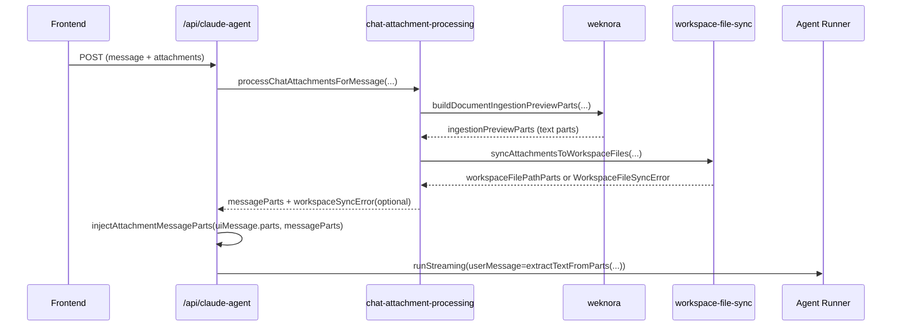

# WeKnora 附件上下文注入设计

## 1. 背景

历史版本 `68c474c5d095b55b1826d1b22a46b03a4ae5e562` 中，`/app/api/claude-agent/route.ts` 直接调用 `buildDocumentIngestionPreviewParts`，将文档解析结果注入 `uiMessage.parts`，再进入 Agent 推理。

后续重构将该逻辑下沉到 `app/lib/chat-attachment-processing.ts`（符合“API 只编排，业务下沉到 lib”的仓库约束），并新增 workspace 文件同步能力。  
本设计目标是明确并固化：**WeKnora 文档预览应稳定进入对话上下文，不应被 workspace 同步失败阻断。**

---

## 2. 目标与非目标

### 2.1 目标

1. 保留并强化 `Process attachments via WeKnora` 能力。  
2. 将文档解析 preview 注入消息上下文（`uiMessage.parts`），供 `extractTextFromParts` 参与最终 `userMessage` 组装。  
3. workspace 文件同步失败时降级处理，不影响 WeKnora preview 注入和对话继续。  
4. 不在 `route.ts` 堆叠复杂逻辑，保持编排与业务分层。

### 2.2 非目标

1. 不改 `chat-schema.ts` 协议字段。  
2. 不改 WeKnora API 协议与服务端实现。  
3. 不引入新的数据库表或迁移。

---

## 3. 功能范围

涉及模块：

1. `app/api/claude-agent/route.ts`
2. `app/lib/chat-attachment-processing.ts`
3. `app/lib/weknora.ts`
4. `app/lib/message-parts.ts`

---

## 4. 方案设计

## 4.1 总体流程



## 4.2 关键行为

1. 先执行 WeKnora preview 构建（`buildDocumentIngestionPreviewParts`），保证文档语义优先进入上下文。  
2. workspace 同步错误通过 `workspaceSyncError` 返回，不抛出中断（降级）。  
3. 路由层收到 `workspaceSyncError` 仅告警日志，继续注入可用 `messageParts` 并继续对话。  
4. 注入位置保持兼容旧行为：插入到最后一个 text part 之前；若无 text part 则追加到尾部。

---

## 5. 数据结构

`processChatAttachmentsForMessage` 返回：

```ts
type ProcessChatAttachmentsForMessageResult = {
  ingestionPreviewParts: DocumentProcessingResult[];
  workspaceFilePathParts: WorkspaceFilePathPart[];
  messageParts: AttachmentDerivedMessagePart[];
  workspaceSyncError?: WorkspaceFileSyncError;
};
```

说明：

1. `ingestionPreviewParts`：WeKnora 解析得到的文本 preview（进入上下文的核心）。  
2. `workspaceFilePathParts`：已成功落地到 workspace 的文件元信息 part。  
3. `workspaceSyncError`：仅用于降级观测，不阻断会话。

---

## 6. 错误处理策略

| 场景 | 处理策略 | 是否中断对话 |
|------|----------|--------------|
| WeKnora 未配置/API 失败/不支持 MIME | `buildDocumentIngestionPreviewParts` 返回空 | 否 |
| workspace MIME 不允许/下载失败/写入失败 | 捕获并返回 `workspaceSyncError` | 否 |
| 请求体校验失败 | route 返回 400 | 是 |
| 工作空间初始化失败 | route 返回 500 | 是 |

---

## 7. 对比旧实现（68c474c5）

旧实现特征：

1. route 直接调用 `buildDocumentIngestionPreviewParts`。  
2. 只处理 WeKnora preview 注入，不处理 workspace 同步。  

当前方案：

1. 逻辑下沉到 `app/lib/chat-attachment-processing.ts`，route 保持编排。  
2. 在保留 WeKnora 注入语义的同时，附加 workspace 同步能力。  
3. workspace 同步失败时不丢失 WeKnora 上下文（本次明确固化的行为）。

---

## 8. 测试设计

最少覆盖：

1. Happy Path：支持类型附件 -> 成功生成 preview 并注入上下文。  
2. Failure Mode：workspace 同步失败（如 `MIME_TYPE_NOT_ALLOWED`）-> 返回 `workspaceSyncError`，对话不被阻断。  

相关测试文件：

1. `app/lib/chat-attachment-processing.test.ts`
2. `app/lib/weknora.test.ts`
3. `app/lib/message-parts.test.ts`

---

## 9. 验收标准

1. 发送包含可解析文档附件的消息时，Agent 能看到注入后的文档 preview 文本。  
2. 即使 workspace 同步失败，也不会因该失败直接返回错误中断聊天。  
3. 路由层不新增复杂业务逻辑，核心处理保留在 `app/lib`。  
4. 单测覆盖成功与失败路径并通过。

---

## 10. 回滚方案

如需回退到“同步失败即中断”的旧行为：

1. 将 `processChatAttachmentsForMessage` 中 workspace 同步错误改回抛出。  
2. route 恢复 `serviceError(...)` 直接返回。  
3. 同步更新对应测试断言。  

建议仅在明确需要“严格同步成功才允许对话”的产品策略下回滚。

