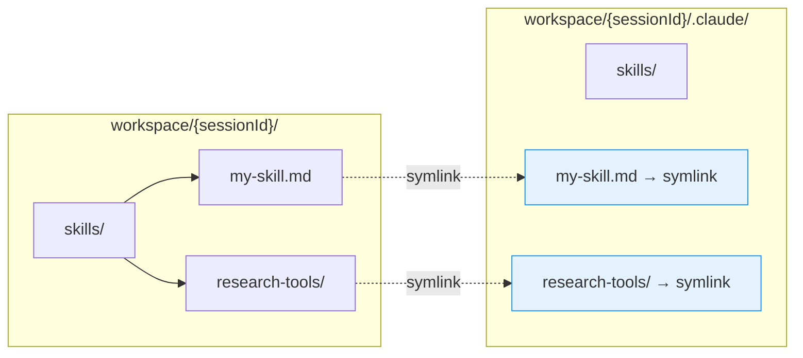
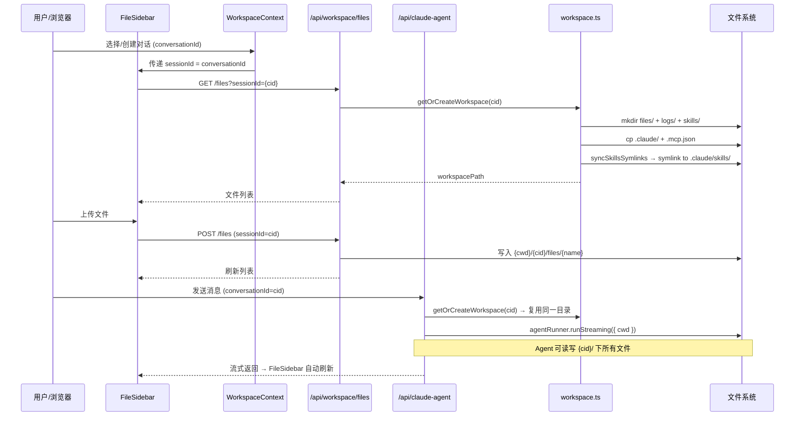
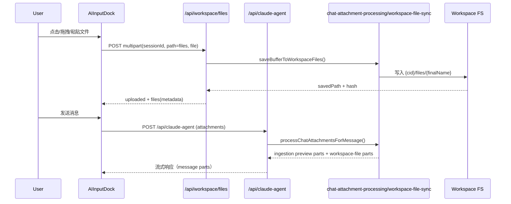

# 工作空间与 Skills 同步 — 全流程图

## 概述

本文档描述了对话工作空间初始化、文件管理、Agent 执行以及 Skills 自动同步的完整数据流。

---

## 核心流程图

```mermaid
flowchart TD
    A[用户发起对话] --> B[前端生成 conversationId]
    B --> C[WorkspaceContext.setActiveConversation]
    C --> D[FileSidebar 自动切换 sessionId]

    D --> E["GET /api/workspace/files?sessionId={conversationId}"]
    E --> F["getOrCreateWorkspace(conversationId)"]
    F --> G{工作空间是否已存在?}
    G -- 否 --> H["initWorkspace(conversationId)"]
    G -- 是 --> I[返回已有路径]

    H --> H1["创建 files/ 目录"]
    H --> H2["创建 logs/ 目录"]
    H --> H3["创建 skills/ 目录"]
    H --> H4["复制 .claude/ 到工作空间"]
    H --> H5["复制 .mcp.json 到工作空间"]
    H3 --> H6["syncSkillsSymlinks()"]
    H6 --> H7["扫描 skills/ 中的文件和文件夹"]
    H7 --> H8["为每个条目创建软链接"]
    H8 --> H9["{workspace}/.claude/skills/{name}"]
    H6 --> H10["清理过期软链接"]

    H --> I

    I --> J[FileSidebar 显示文件列表]

    K[用户上传文件] --> L["POST /api/workspace/files"]
    L --> M["写入 {AGENT_CWD}/{conversationId}/files/{filename}"]
    M --> J

    N[用户发送消息] --> O["POST /api/claude-agent"]
    O --> P["getOrCreateWorkspace(conversationId)"]
    P --> Q["agentRunner.runStreaming({ cwd: workspacePath })"]
    Q --> R["Agent 读写 {conversationId}/ 下的文件"]
    R --> S["Agent 可能生成新文件"]
    S --> J

    style H3 fill:#e8f5e9,stroke:#4caf50,stroke-width:2px
    style H6 fill:#e8f5e9,stroke:#4caf50,stroke-width:2px
    style H8 fill:#e8f5e9,stroke:#4caf50,stroke-width:2px
    style H9 fill:#fff3e0,stroke:#ff9800,stroke-width:2px
```



---

## Skills 同步机制详情



### 为什么用软链接？

Claude SDK 被调用时设置 `cwd = workspacePath` 且 `settingSources: ["project"]`，
因此 Claude 从 `{workspacePath}/.claude/skills/` 读取 skills。

我们让用户/Agent 在更直观的 `{workspace}/skills/` 目录操作，然后自动软链接到
`{workspace}/.claude/skills/` 供 Claude 发现。

**关键优势**：
1. 每个对话工作空间完全隔离，无命名冲突
2. 同时支持**文件和文件夹**软链接
3. 无需 sessionId 前缀 — 工作空间本身就是隔离边界
4. 每次同步自动清理失效的链接

### 同步触发时机

| 时机 | 触发函数 | 说明 |
|------|----------|------|
| 工作空间初始化 | `initWorkspace()` → `syncSkillsSymlinks()` | 首次创建时自动同步 |
| 访问已有工作空间 | `getOrCreateWorkspace()` → `syncSkillsSymlinks()` | 每次访问重新同步 |
| 写入 skills/ | `writeWorkspaceFile()` → `syncSkillsSymlinks()` | 上传 skill 文件后自动同步 |
| 删除 skills/ | `deleteWorkspaceFile()` → `syncSkillsSymlinks()` | 删除后清理链接 |
| 移动涉及 skills/ | `moveWorkspaceFile()` → `syncSkillsSymlinks()` | 移动后更新链接 |

---

## 数据通道总览



---

## 环境变量

| 变量 | 默认值 | 说明 |
|------|--------|------|
| `AGENT_CWD` | `/tmp/claude-agent-workspaces` | 工作空间根目录；生产环境建议设为持久化路径 |

```
AGENT_CWD=/data/workspaces (生产环境)
  └── {conversationId}/            ← Claude SDK cwd
      ├── .claude/                 ← 从项目根复制
      │   └── skills/              ← 软链接目标目录
      │       ├── my-skill.md      → symlink → skills/my-skill.md
      │       └── research-tools/  → symlink → skills/research-tools/
      ├── .mcp.json                ← 从项目根复制
      ├── files/                   ← 用户上传 + Agent 生成
      ├── logs/                    ← Agent 日志
      └── skills/                  ← 对话级 skills（用户操作此目录）
            ├── my-skill.md
            └── research-tools/    ← 支持文件夹
                └── web-search.md
```

---

## 会话输入框上传与工作空间同步（新增）

### 触发方式

会话输入框（`AIInputDock`）支持三种上传入口，并在 UI 中显示提示文案：

- 点击选择文件（`+ Add`）
- 拖拽文件到输入框区域
- 粘贴文件（`Ctrl/Cmd + V`）

### 保存路径规则

输入框上传后会调用 `POST /api/workspace/files`（`path=files`），文件落盘到：

`{AGENT_CWD}/{conversationId}/files/{finalName}`

规则如下：

- 始终写入工作空间 `files/` 目录
- 文件名会做安全清洗（去除路径分隔符、控制字符等）
- 同名冲突自动重命名（如 `report-1.pdf`、`report-2.pdf`）
- 路径安全校验，禁止路径穿越
- 上传限制：最大 `50MB`，并校验允许的 MIME 类型

### Message Parts 协议新增字段

在保留现有 `DocumentProcessingResult`（文本 preview part）的同时，新增 `workspace-file` part：

```json
{
  "type": "workspace-file",
  "fileName": "report.pdf",
  "mimeType": "application/pdf",
  "size": 123456,
  "workspacePath": "files/report.pdf",
  "savedAt": "2026-02-07T22:00:00.000Z",
  "hash": "sha256-hex-optional"
}
```

对应 schema 位于：`app/lib/chat-schema.ts` 的 `WorkspaceFilePathPartSchema`。

### 错误处理

文件同步失败时，接口返回统一错误结构：

```json
{
  "error": "File MIME type is not allowed: application/x-msdownload",
  "code": "MIME_TYPE_NOT_ALLOWED",
  "details": {
    "index": 0,
    "fileName": "malware.exe",
    "mimeType": "application/x-msdownload"
  }
}
```

常见错误码：

- `INVALID_ATTACHMENT`
- `INVALID_WORKSPACE_PATH`
- `FILE_TOO_LARGE`
- `MIME_TYPE_NOT_ALLOWED`
- `DOWNLOAD_FAILED`
- `WRITE_FAILED`
- `INTERNAL_ERROR`

### 请求/响应示例

#### 1) 输入框上传到工作空间

请求：

`POST /api/workspace/files`（`multipart/form-data`）

- `sessionId`: `conversationId`
- `path`: `files`
- `file`: 一个或多个文件

响应：

```json
{
  "uploaded": ["files/report.pdf"],
  "files": [
    {
      "type": "workspace-file",
      "fileName": "report.pdf",
      "mimeType": "application/pdf",
      "size": 123456,
      "workspacePath": "files/report.pdf",
      "savedAt": "2026-02-07T22:00:00.000Z",
      "hash": "2cf24dba5fb0a30e26e83b2ac5..."
    }
  ]
}
```

#### 2) 发送会话消息（带附件）

请求体（节选）：

```json
{
  "id": "conv_123",
  "message": {
    "id": "msg_1",
    "role": "user",
    "parts": [
      { "type": "file", "url": "https://...", "filename": "report.pdf", "mediaType": "application/pdf" },
      { "type": "text", "text": "请总结这个文件" }
    ]
  },
  "attachments": [
    {
      "type": "file",
      "url": "https://...",
      "filename": "report.pdf",
      "mediaType": "application/pdf",
      "workspacePath": "files/report.pdf",
      "savedAt": "2026-02-07T22:00:00.000Z",
      "hash": "2cf24dba5fb0a30e26e83b2ac5..."
    }
  ]
}
```

服务端会在用户消息 part 中注入：

- 文档 ingestion 文本 part（既有）
- `workspace-file` 路径描述 part（新增）

### 上传到回写时序图


